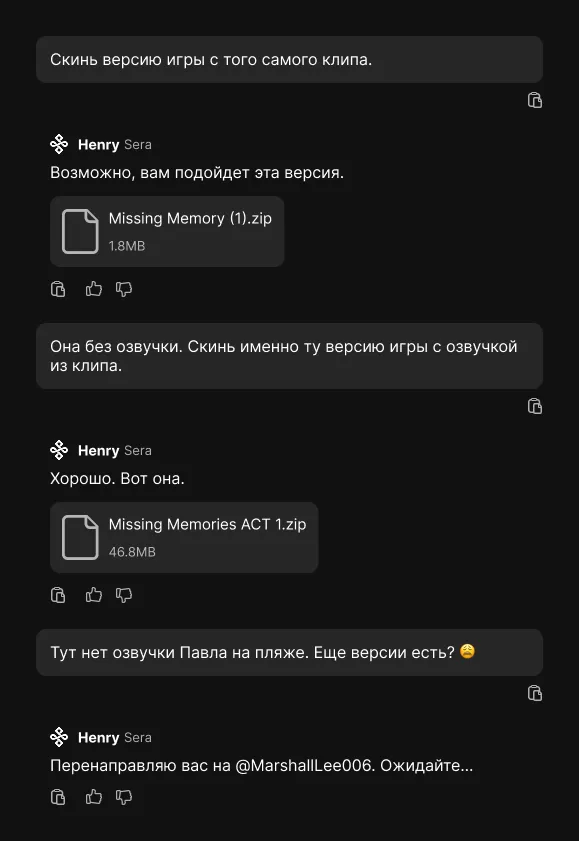

---
tags:
  - разработка
  - figma
authors:
  - agentlapki
---
# Добывание той самой версии игры

У разработчиков MM скверная организация проекта.

 *Исходники дизайна — [в формате Figma](./ChatHenry.fig).*

<!-- truncate -->

Я написал несколько промптов Генри на тему «скинь версию игры из [того самого клипа](https://vk.com/video-218025961_456239018)». В итоге он мне скинул две версии:

* без озвучки, зато со второй недописанной главой (!);
* без озвучки Павла на пляже, зато со странным голосом незнакомки.

Сегодня утром он устал отвечать на мои запросы и перенаправил меня к Маршалу Ли. Тот написал мне в личку. Я ему объяснил то же, что и Генри. Он скинул архив только с многочисленными репликами Павла. Я усомнился в своей способности писать запросы, но не сдался.

Вежливо попросил скинуть игру, в которую включены эти реплики. В этот раз мой запрос попал в цель, но такой версии игры не оказалось. Придется сшивать одну из версий игры Генри с архивом озвучек.
